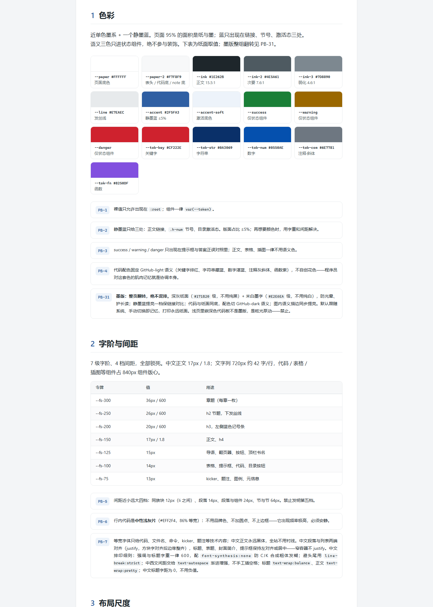
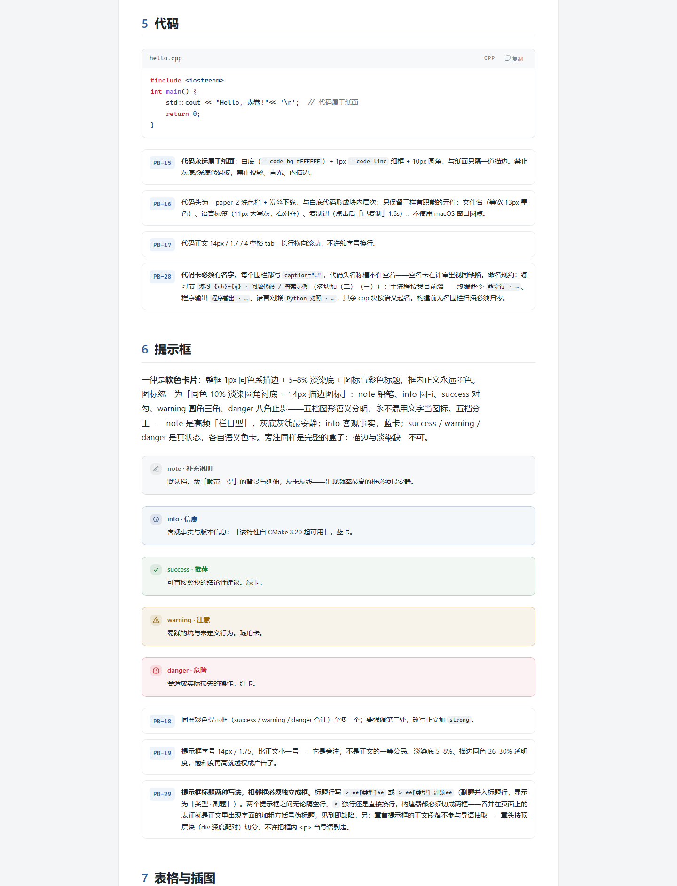
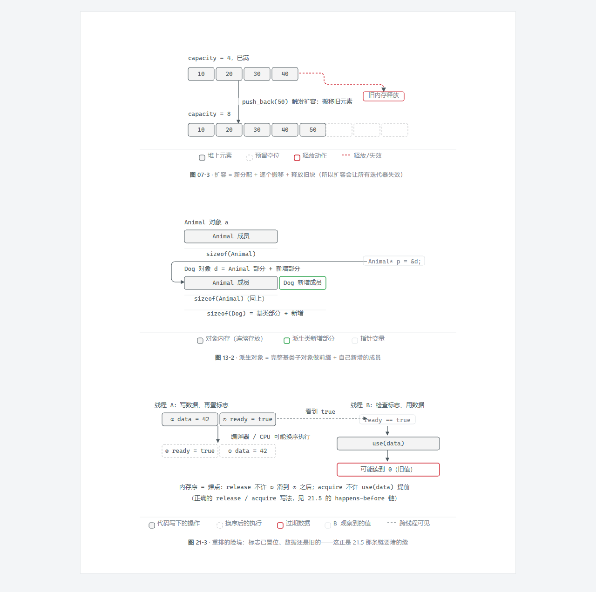

# Plain Book (素卷) Design System

A single-file, token-driven front-end design specification for programming books — the page designed as a **documentation site**: a centered single-column reading flow with a 720px text measure inside an 840px component measure; the full-book table of contents behind a top button that slides in a drawer, plus an on-this-page outline rail on wide screens (scroll-following); a near-monochrome ink palette with a single ink-blue accent; white-background code in a hairline border (GitHub-light syntax palette); callouts as soft tinted cards; figures in a semantic palette of vivid strokes on white fills. Two full-page themes — paper and ink (PB-31): the ink theme flips the entire page (deep-grey paper, off-white ink, lifted accent, GitHub-dark code), never a light page with a dark code slab; it follows the system by default and remembers a manual choice. The page is both the spec and its reference implementation; the book consumes its `<style>` block verbatim (see Usage).

[简体中文](README.zh-CN.md) · Version v1.0

## Screenshots

| Tokens | Components |
|:---:|:---:|
|  |  |

| Book cover | Semantic figure palette |
|:---:|:---:|
|  |  |

## Highlights

- **One self-contained file.** Spec, stylesheet and reference implementation live in a single `index.html` (~63 KB). No build step, no server, no dependencies.
- **Token-driven throughout.** Every raw value is declared in `:root` (and re-declared as a set for the ink theme); every component references `var(--token)`.
- **32 numbered rules (PB-1 … PB-32) across 9 sections + three prime principles.** Checkable phrasing with explicit thresholds ("accent ≤5% of the page", "spacing uses exactly 12/14/24/64").
- **Three prime principles:** zero ornament (hierarchy comes only from type scale, spacing, hairlines); single column, navigation on demand (drawer for the whole book, a right on-this-page rail on wide screens); code belongs on the page surface (light background in paper theme, dark in ink theme — always the same surface as the page, never a floating slab).
- **CJK typesetting built in (PB-7):** justified body with `line-break: strict`, `text-autospace`, heading `text-wrap: balance` and body `pretty`, weight 600 with `font-synthesis: none` against faux-bold, no negative letter-spacing for Chinese headings.
- **Semantic figure palette (PB-30):** vivid strokes on white fills — brick red for freed/dangling/UB/lost-data, bright green for fresh allocations, violet for external systems; borders only, never background tints; in-figure text always ink; neutral states stay grey dashed and never masquerade as danger.

## Usage

Open `index.html` directly in a browser. When generating book pages, lift the main `<style>` block (the book CSS) into `assets/style.css` verbatim and assemble pages on the §3 `topbar / drawer / pagerail / main / prose` skeleton.
