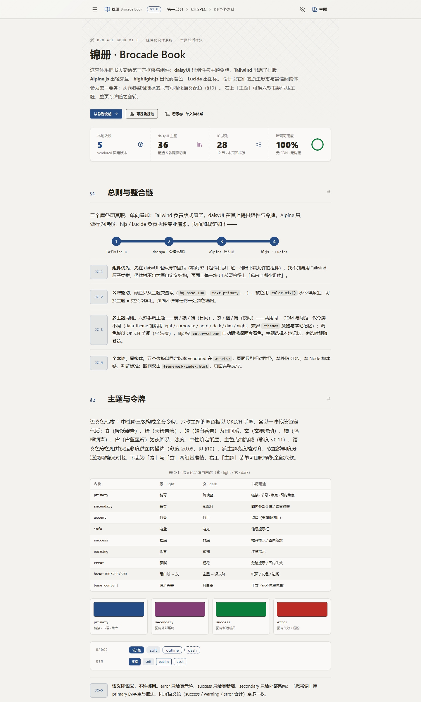
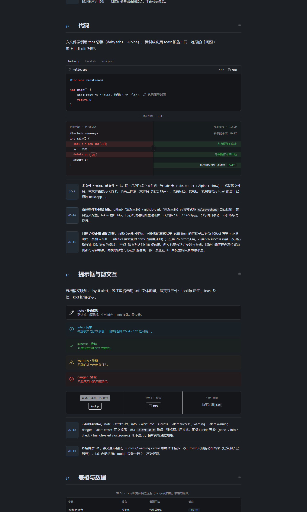

# Book Design Systems — 素卷 · 锦册

Two parallel front-end design systems for programming books live in this repository as sibling directories. They share the same reading anatomy — centered single column, a 720px text measure inside a component measure, drawer TOC + on-this-page outline rail, five-level callouts, CJK typesetting — and the same figure semantics (vivid strokes on white fills + the seven edge rules + dg taxonomy, canon held by Plain Book and re-tokened in Brocade). They differ in technological stance: Plain Book is zero-dependency and single-file; Brocade is framework-first on fully vendored libraries. Each is versioned v1.0.

[简体中文](README.zh-CN.md)

## Which system when

| | 素卷 · Plain Book | 锦册 · Brocade Book |
|---|---|---|
| Path | `plain/index.html` | `brocade/index.html` |
| Stance | Zero dependencies, one self-contained file | daisyUI 5 + Tailwind 4 + Alpine 3 + highlight.js 11 + Lucide, all vendored at pinned versions |
| Role | The production system for the book — pages consume its `<style>` block verbatim | The componentized system — component-native forms and multi-theme experience first |
| Themes | Paper / ink (PB-31) | Six hand-tuned OKLCH palettes in classical pigment tones |
| Rules | 32 rules (PB-1 … PB-32) + three prime principles | 28 rules (JC-1 … JC-28) across 12 sections |
| JavaScript | Fully readable with JS off | JS as enhancement only (checkbox drawer, `details`, native `dialog`, native diff drag) |

The figure/visualization semantics above are canonical in Plain Book; Brocade carries them re-tokened onto daisyUI theme variables so figures re-theme too — evolve them in Plain Book first.

## 素卷 · Plain Book v1.0 — `plain/`

A single-file, token-driven front-end design specification for programming books — the page designed as a **documentation site**: a centered single-column reading flow; the full-book table of contents behind a top button that slides in a drawer, plus an on-this-page outline rail on wide screens (scroll-following); a near-monochrome ink palette with a single ink-blue accent; white-background code in a hairline border (GitHub-light syntax palette); callouts as soft tinted cards; figures in a semantic palette of vivid strokes on white fills. Two full-page themes — paper and ink (PB-31): the ink theme flips the entire page (deep-grey paper, off-white ink, lifted accent, GitHub-dark code), never a light page with a dark code slab; it follows the system by default and remembers a manual choice. The page is both the spec and its reference implementation; the book consumes its `<style>` block verbatim (see Usage).

### Screenshots

| Tokens | Components |
|:---:|:---:|
|  |  |

| Book cover | Semantic figure palette |
|:---:|:---:|
|  |  |

### Highlights

- **One self-contained file.** Spec, stylesheet and reference implementation live in a single `plain/index.html` (~63 KB). No build step, no server, no dependencies.
- **Token-driven throughout.** Every raw value is declared in `:root` (and re-declared as a set for the ink theme); every component references `var(--token)`.
- **32 numbered rules (PB-1 … PB-32) across 9 sections + three prime principles.** Checkable phrasing with explicit thresholds ("accent ≤5% of the page", "spacing uses exactly 12/14/24/64").
- **Three prime principles:** zero ornament (hierarchy comes only from type scale, spacing, hairlines); single column, navigation on demand (drawer for the whole book, a right on-this-page rail on wide screens); code belongs on the page surface (light background in paper theme, dark in ink theme — always the same surface as the page, never a floating slab).
- **CJK typesetting built in (PB-7):** justified body with `line-break: strict`, `text-autospace`, heading `text-wrap: balance` and body `pretty`, weight 600 with `font-synthesis: none` against faux-bold, no negative letter-spacing for Chinese headings.
- **Semantic figure palette (PB-30):** vivid strokes on white fills — brick red for freed/dangling/UB/lost-data, bright green for fresh allocations, violet for external systems; borders only, never background tints; in-figure text always ink; neutral states stay grey dashed and never masquerade as danger.

### Usage

Open `plain/index.html` directly in a browser. When generating book pages, lift the main `<style>` block (the book CSS) into `assets/style.css` verbatim and assemble pages on the §3 `topbar / drawer / pagerail / main / prose` skeleton.

## 锦册 · Brocade Book v1.0 — `brocade/`

`brocade/index.html` is the componentized design system. It keeps the book's reading anatomy (single column, 720px text column in an 880px component measure, drawer TOC + on-this-page rail, five-level callouts, CJK typesetting) but is designed framework-first: component-native forms and best reading experience per the libraries come first, and only the figure/visualization semantics are carried over from Plain Book — retokened to daisyUI theme variables so figures re-theme too. The chapter hero carries the system's single decorative motif: a 1px crosshatch brocade lattice derived from the primary token, fading out downward — the mark of the Brocade Book name.

- **daisyUI 5.7.47** — the component backbone: navbar (glass), drawer + menu, dropdown theme picker, breadcrumbs, tabs, diff, alert (+soft/outline/dash modifiers), table-zebra, collapse, steps, timeline, join, hero, card, stats + radial-progress, toast, tooltip, kbd, modal (figure zoom), mockup-window, status, skeleton, loading, divider. The theme menu offers six hand-tuned OKLCH palettes in classical pigment tones — 素 / 缥 / 皓 (day) and 玄 / 檀 / 宵 (night) — declared in-page over the stock theme variables (data-theme keys light / corporate / nord / dark / dim / night kept for deep-link and localStorage compatibility).
- **Tailwind CSS 4.3.3** (browser build) — layout/spacing/typography utilities, token gradients, hover transitions, responsive + min-[1400px] rail breakpoint.
- **Alpine.js 3.17.4** (+ Intersect) — tab switching, copy-to-toast feedback, Esc-to-close, scroll-following outline rail.
- **highlight.js 11.12.0** — github / github-dark code themes that follow each theme's `color-scheme` automatically (cpp / bash / json samples).
- **Lucide 0.577.0** — stroke icons throughout (menu, swatch-book, sun/moon, the five callout glyphs, timeline markers).

All libraries (incl. `themes.css`) are vendored in `brocade/assets/` at pinned versions — no CDN, no build step; double-clicking the file offline renders the page complete. 28 numbered rules (JC-1 … JC-28) across 12 sections govern it: components-first with a whitelist, token-driven colors (zero raw color values), multi-theme isomorphism, JS as enhancement only. Open `brocade/index.html` in a browser.

| Day theme | Night theme |
|:---:|:---:|
|  |  |
